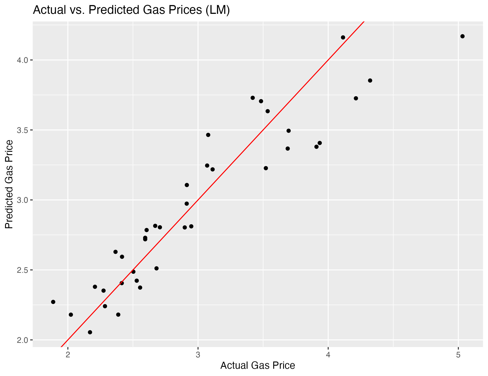
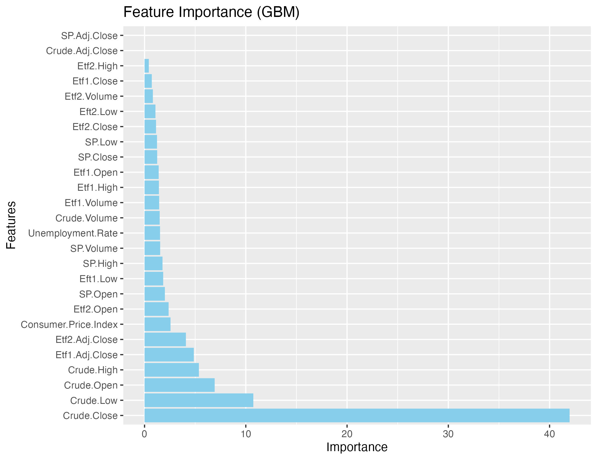

# 📈 Gas Price Forecasting Engine

[](https://www.python.org/)
[](https://www.r-project.org/)
[](https://xgboost.readthedocs.io/)
[](https://opensource.org/licenses/MIT)

## 🎯 Project Overview
An advanced forecasting system that predicts US average gas prices using a comprehensive set of economic indicators and market variables. The project combines traditional statistical methods with modern machine learning techniques to provide accurate price predictions.

## 🔍 Key Features
- Multi-factor price prediction model
- Dual modeling approach:
  - Linear Regression for baseline and interpretability
  - Gradient Boosting for enhanced accuracy
- Economic indicator integration
- Market trend analysis
- Monthly forecast generation

## 📊 Data Sources & Variables

### Economic Indicators
- Unemployment rates (1993-2023)
- Consumer Price Index (CPI)
- Crude oil price trends
- S&P 500 performance

### Energy Sector Metrics
- XLE Energy ETF performance
- VDE Energy ETF trends
- Historical gas prices
- Seasonal patterns

## 🛠️ Technical Implementation

### Machine Learning Pipeline
1. **Data Collection & Preprocessing**
   - API integration for market data
   - Economic database connections
   - Time series alignment
   - Missing value handling

2. **Feature Engineering**
   - Temporal feature extraction
   - Market indicator derivation
   - Economic factor integration
   - Seasonal decomposition

3. **Model Development**
   - Linear Regression baseline
   - XGBoost implementation
   - Cross-validation framework
   - Hyperparameter optimization

## 📈 Model Performance

### Linear Regression Results

- Strong baseline performance
- Clear feature importance insights
- Robust residual analysis

### Gradient Boosting Results

- Enhanced prediction accuracy
- Feature importance ranking
- Reduced prediction error

## 📁 Repository Structure
```bash
project/
├── SCRIPTS/
│   ├── 1 - API call.py           # Data collection
│   ├── 2 - Creating Dataset.Rmd  # Data preprocessing
│   └── 3 - Modelling.r          # Model implementation
├── DATA/
│   ├── PREPROCESSING/            # Raw data sources
│   └── final_data.csv           # Processed dataset
├── OUTPUT/                      # Visualization results
└── models/                     # Model implementations
```

## 🚀 Getting Started

### Prerequisites
- Python 3.8+
- R 4.0+
- Required packages:
  ```bash
  pip install -r requirements.txt
  ```

### Running the Analysis
1. Data Collection:
   ```bash
   python SCRIPTS/1\ -\ API\ call.py
   ```
2. Data Preprocessing:
   ```R
   Rscript -e "rmarkdown::render('SCRIPTS/2\ -\ Creating\ Dataset.Rmd')"
   ```
3. Model Training:
   ```R
   Rscript SCRIPTS/3\ -\ Modelling.r
   ```

## 📊 Key Findings
- Identified strong correlation between crude oil prices and gas prices
- Discovered seasonal patterns in price fluctuations
- Quantified impact of economic indicators
- Achieved high prediction accuracy for monthly forecasts

## 👤 Developer
Andre Chuabio
- GitHub: [@AndreChuabio](https://github.com/AndreChuabio)

## 📝 License
This project is licensed under the MIT License - see the [LICENSE](LICENSE) file for details.

## 🙏 Acknowledgments
- Federal Reserve Economic Data (FRED)
- Energy Information Administration (EIA)
- Financial market data providers

---
⭐️ Built with advanced statistical and machine learning techniques


